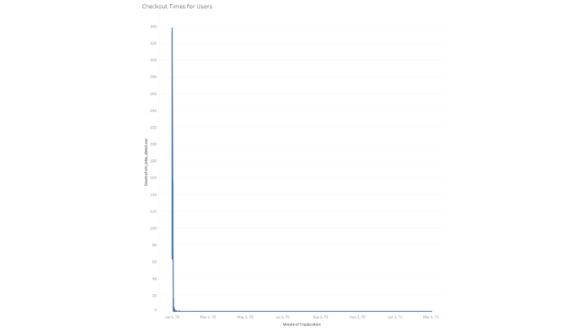
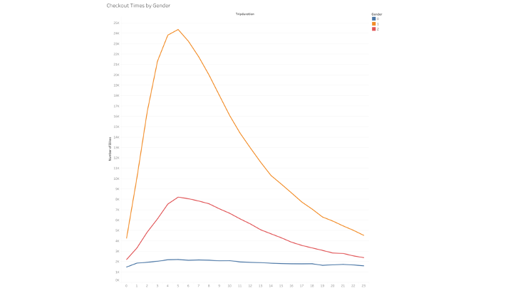
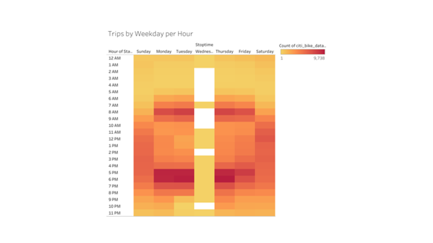
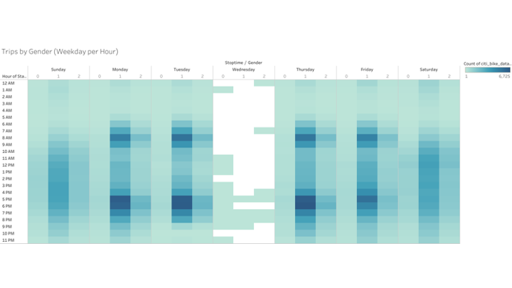
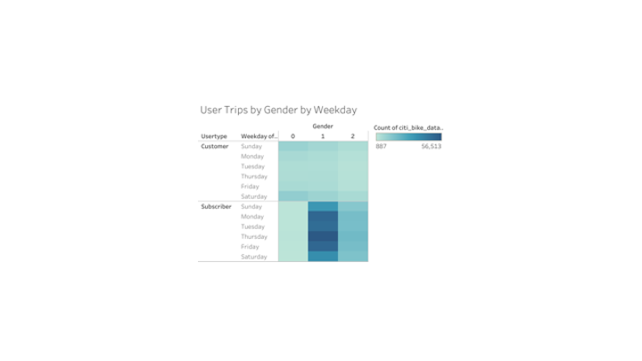

# Bikesharing
## Overview of the analysis 
- The purpose of this analysis was to compare data using Tableau for riders in NYC to see if Des Moines, IA would be an ideal place for the next CitiBike investment.

## Results

- The checkout times for users showed the first three hours had the most activity of the day.

- The checkout times by gender showed that males were the main users of CitiBikes.

- The trips by weekday for each hour graph shows the most popular times to rent a bike during the week are in the mornings and evenings, presumably for work. 

- The trips by gender graph shows similar information that show males using CitiBikes the most in the mornings and evenings.

- The user trips by gender shows the most subscriptions are for the male category. 
 
## Summary 
- Based on the results, it is clear that the best times to for CitiBike to operate the most bikes are during the morning and evening hours, presumably when people are going to work. The subscription model should be more heavily marketed to the male population as they seem to have more subscriptions based on the heatmaps. A heat map of population density of these areas would be another good visualization to help understand where to have Citibikes. Another would be a graph showing the average time of use for each bike to have a better idea of the need for maintenance for each bike. 

[link to dashboard](https://public.tableau.com/app/profile/zachary.kriegshauser/viz/NYCCitiBookChallenge/Story1)

